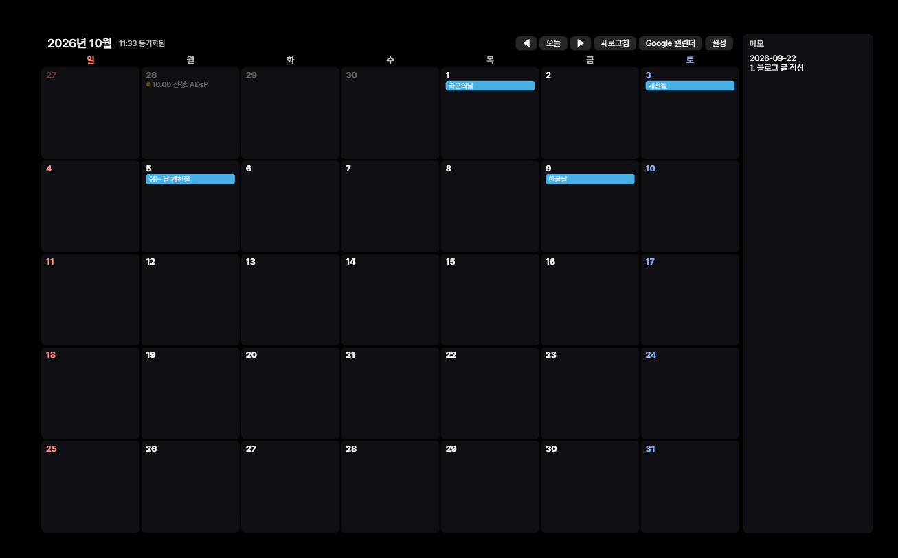
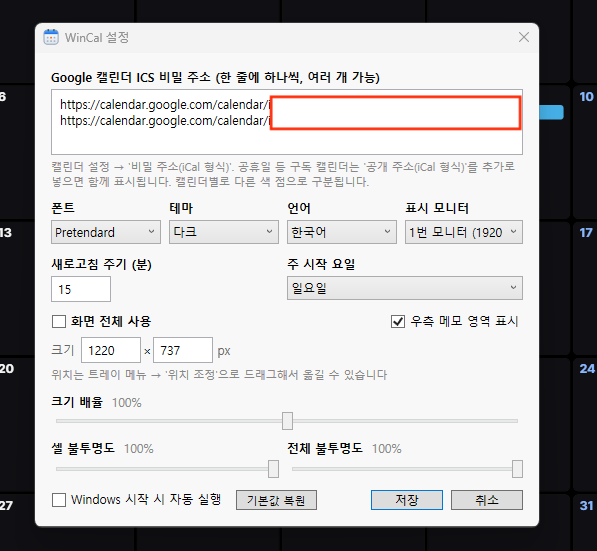

# WinCal

[한국어](README.ko.md)

A monthly calendar widget that lives **on the Windows desktop** — rendered above the wallpaper, below the desktop icons, DesktopCal-style. No taskbar button, no Alt+Tab entry; it resides in the system tray only.



## Features

- Monthly calendar grid pinned to the desktop
  - Modern Win11 desktop (XAML islands): z-order pinned above `Progman` + full click-through
  - Classic desktop (`SHELLDLL_DefView`): attached as a `WorkerW` child window (auto-detected)
- **Read-only** Google Calendar sync via secret iCal (ICS) URLs — **no OAuth required**
  - Multiple calendars supported (one URL per line), per-calendar color dots/chips
  - All-day events render as colored chips; timed events show `HH:mm` + title
- **Stickers**: free-floating translucent notes on the widget (double-click a cell to create)
- **Side memo panel**: a fixed notepad on the right edge — double-click to type inline
- Header bar: prev/next month, today, refresh, Google Calendar, settings
- Tray menu: refresh, Google Calendar, add sticker, **adjust position** (drag/resize, then lock), settings, exit
- Settings: ICS URLs, font (Pretendard bundled), theme (Dark/Light/Minimal/Warm),
  language (한국어/English), monitor, refresh interval, week start day,
  full-screen/region mode, UI scale, cell/window opacity, run at startup
- RRULE recurrence expansion, timezone conversion, multi-day event spans (Ical.Net)

## Install

**Just run it** — grab `WinCal.exe` from [Releases](https://github.com/jaymunsh/win-cal/releases)
and double-click. No installer, no .NET required (self-contained single file, ~72 MB).
The calendar pins itself to the desktop; the app lives in the system tray.

> **Note:** The exe is not code-signed, so Windows may show a SmartScreen warning
> ("Windows protected your PC") on first run — click **More info → Run anyway**.
> Each release lists a SHA256 hash; verify with `certutil -hashfile WinCal.exe SHA256`.

## Usage

1. Google Calendar → Settings → your calendar → "Integrate calendar" → copy **"Secret address in iCal format"**
2. Run WinCal → paste the URL(s) into Settings
3. Position/resize: tray menu → "Adjust position" → drag, then "Done (lock)"
4. Editing events stays in Google Calendar — the "Google Calendar" button opens it in the browser



## Build from source

```bash
dotnet build win-cal.sln

# Single-file self-contained build (~72 MB, runs without .NET)
dotnet publish WinCal -c Release -r win-x64 --self-contained `
  -p:PublishSingleFile=true -p:IncludeNativeLibrariesForSelfExtract=true `
  -p:EnableCompressionInSingleFile=true
```

## Architecture

- `DesktopAttacher.cs` — desktop pinning (classic WorkerW / modern z-order, auto-selected)
- `MouseHook.cs` — `WH_MOUSE_LL` to observe desktop clicks (the window is click-through)
- `DesktopIcons.cs` — UI Automation hit-testing so icon clicks pass through (SysListView32 + XAML islands)
- `CalendarService.cs` — ICS download + Ical.Net occurrence expansion (cached per month)
- `StickerStore.cs` / `SettingsStore.cs` — JSON persistence in `%AppData%\WinCal\`
- `Themes.cs` — theme palettes; `Loc.cs` — Korean/English string tables
- Debugging: set `"DebugLogEnabled": true` in `settings.json` → `debug.log`

## Limitations

- ICS secret feeds are cached by Google — changes may take minutes to hours to appear
- "All monitors" mode stretches one grid across displays (per-monitor widgets unsupported)
- Read-only: event editing happens in Google Calendar (write support would require OAuth)

## License

- Code: [MIT](LICENSE)
- Bundled font Pretendard: SIL Open Font License 1.1 (`WinCal/Assets/Fonts/LICENSE-Pretendard.txt`)

Not affiliated with or endorsed by Google.
